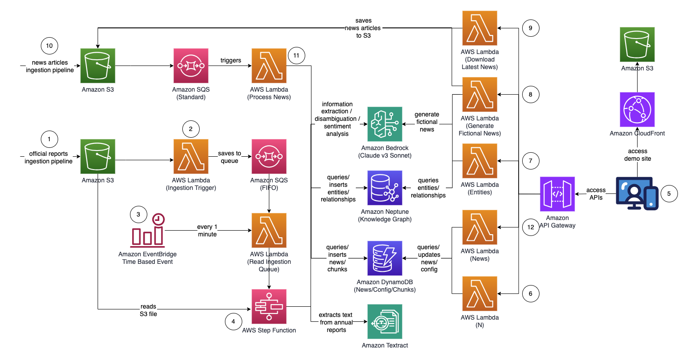
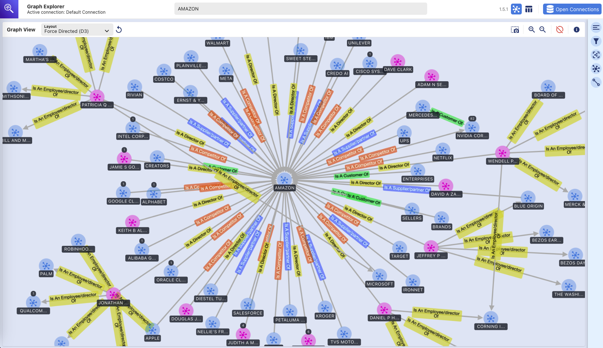

# Uncovering Hidden Connections in Unstructured Financial Data using Amazon Bedrock and Amazon Neptune

This repository contains code to deploy a prototype solution that demonstrates how Generative AI and knowledge graph can be combined to create a scalable, event-driven, serverless system to process unstructured data for financial services. This solution can help asset managers in your organization uncover hidden connections in their investment portfolios and provides a sample easy-to-use user interface to consume financial news and understand its connections to their investment portfolios.

## Business Use Case
Asset managers generally invest in large number of companies in their portfolios, and they need to be able to keep track of any news related to those companies because these news would help them stay ahead of market movements, identify investment opportunities, and better manage their investment portfolio.

Generally, news tracking can be done easily by setting up a simple keyword based news alert using the investee company name, but this becomes increasingly difficult when the news event does not impact the investee company directly.  For example the impact could be to a supplier of an investee company which would potentially disrupt the company's supply chain. Or the impact could be to a customer of a customer of your investee company.  If these companies have their revenues concentrated to a few key customers, this would potentially have a negative financial impact to your investment.

Such second or third-order order impact are difficult to identify and even harder to track.  With this automated solution, asset managers can build up a knowledge graph of the relationships surrounding their investment portfolio, and then make use of this knowledge to draw correlation & insights from latest news.

## Architecture


## Step Function Graph (from point #4)


## Solution flow (step by step)
1. Upload official proxy/annual/10k reports (.PDF) to Amazon S3 bucket.  
    * The name of the S3 bucket to upload to can be retrieved from [CloudFormation console - main stack](https://console.aws.amazon.com/cloudformation/home) output - "IngestionBucket"
    * Note that the reports used should be officially published reports to minimize the inclusion of inaccurate data into your knowledge graph (as opposed to news/tabloids).
2. S3 event notification triggers an AWS Lambda function which sends the S3 bucket/file name to an Amazon Simple Queue Service Queue (FIFO).
    * The use of FIFO queue is to ensure that the report ingestion process is performed sequentially to reduce the likelihood of introducing duplicate data into your knowledge graph.
3. An Amazon EventBridge time based event runs every minute to invoke an AWS Lambda function.  The function will retrieve the next available queue message from SQS and start the execution of an AWS Step Function asynchronously.
4. A step function state machine executes through a series of tasks to process the uploaded document by extracting out key information and inserting them into your knowledge graph.
    * Tasks
        1. Downloads proxy/annual/10k report file (PDF) from S3 and splits it into multiple smaller text chunks (~1000 words) for processing.  Store the text chunks in Amazon DynamoDB.
        2. Using Anthropic’s Claude v3 Sonnet on Amazon Bedrock, process the first few text chunks to determine the main entity that the report is referring to, together with relevant attributes (e.g. industry).
        3. Retrieves the text chunks from DynamoDB and for each text chunk, invokes a lambda function to extract out entities (company/person), and its relationship (customer/supplier/partner/competitor/director) to the main entity using Amazon Bedrock.
        4. Consolidate all extracted information
        5. Filters out noise / irrelevant entities (i.e. generic terms such as "consumers") using Amazon Bedrock.
        6. Use Amazon Bedrock to perform disambiguation by reasoning using the extracted information against the list of similar entities from the knowledge graph.  If the entity does not exist, insert it.  Otherwise, use the entity that already exists in the knowledge graph. Inserts all relationships extracted.
        7. Perform clean up by deleting the SQS queue message & the S3 file.
    * Once this step completes, your knowledge graph is updated and ready to use.
5. A user accesses a React-based web application to view the news articles which are enriched with entity/sentiment/connection path information.
    * URL for the web application can be copied from [CloudFormation console - webapp stack](https://us-east-1.console.aws.amazon.com/cloudformation/home) output - "WebApplicationURL"
    * As this is a sample solution for demo purposes, the user specifies the API endpoint, API key, and News API key on the web application by clicking on the gear icon on the top right hand corner.
        * API endpoint can be copied from [CloudFormation console - main stack](https://console.aws.amazon.com/cloudformation/home) output - "APIEndpoint".
        * API key can be copied from [API Gateway API Key console - main stack](https://console.aws.amazon.com/apigateway/main/api-keys).
        * News API key can be obtained from [NewsAPI.org](https://newsapi.org/) after you create an account for free.
        * Click on the "Refresh Settings" button after filling in the values.
6. Using the web application, a user specifies the number of hops (default N=2) on the connection path to monitor.
    * To do so, click on the gear icon on the top right corner and then specify the value of N.
7. Using the web application, a user specifies the list of entities to track.
    * To do so, click on the gear icon on the top right corner and then toggle the "Interested" switch which marks the corresponding entity as INTERESTED=YES/NO.
    * ***This is an important step, and must be done before any news articles are processed.***
8. To generate fictional news, a user clicks on the button, "Generate Sample News" to generate 10 sample financial news with random content to be fed into the news ingestion process.
    * Content are generated using Amazon Bedrock and are purely fictional.
9. To download actual news, a user clicks on the button, "Download Latest News" to download the top news happening today (powered by NewsAPI.org).
10. Upload news (.TXT) to S3 bucket.
    * The name of the S3 bucket to upload to can be retrieved from [CloudFormation console - main stack](https://console.aws.amazon.com/cloudformation/home) output - "NewsBucket"
    * Steps #8 or #9 have uploaded news to the S3 bucket automatically, but you can also build integrations to your preferred news provider such as [AWS Data Exchange](https://aws.amazon.com/data-exchange/) or any 3rd party news provider to drop news articles as files into the S3 bucket.
    * News data file content should be formatted as: \<date>{dd mmm yyyy}\</date>\<title>{title}\</title>\<text>{news content}\</text>
11. S3 event notification sends the S3 bucket/file name to SQS (standard) which triggers multiple lambda functions to process the news data in parallel.
    * Using Amazon Bedrock, the lambda function extracts out entities mentioned in the news together with any related information, relationships & sentiment of the mentioned entity.
    * It then checks against the knowledge graph and use Amazon Bedrock to perform disambiguation by reasoning using the available information from the news and from within the knowledge graph to identify the corresponding entity.
    *  Once the entity has been located, it then searches for and return any connection paths connecting to entities marked with INTERESTED=YES in the knowledge graph that are within N=2 hops away.
12.  The web application auto refreshes every 1 second to pull out the latest set of processed news to display on the web application.

#### React Web Application - Settings


## Graph Explorer


This repository also deploys Graph Explorer ([github/aws/graphexplorer](https://github.com/aws/graph-explorer)) which is a React-based web application that enables users to visualize the entities & relationships extracted.  
* To access the Graph Explorer, retrieve the URL from [CloudFormation console - main stack](https://console.aws.amazon.com/cloudformation/home) output - "GraphExplorer"
* When accessing the web application, you will receive a warning of potential security risk on your browser as the certificate used for the site is self signed.  You may continue to proceed.  To get rid of the warning, [read this](https://github.com/aws/graph-explorer#https-connections).
* Once launched, the application will automatically connect to AWS Neptune database and synchronise its data.  You may click on the refresh icon any time to re-synchronise the data.
* Click on "Open Graph Explorer" on the top right to start visualizing the knowledge graph. 
* Go to [github/aws/graphexplorer](https://github.com/aws/graph-explorer) for more information on Graph Explorer.
* Note that Graph Explorer is not required as part of the solution but makes it easier for you to explore the relationships extracted.

#### Demo - Getting Started with Graph Explorer

<video src="https://github.com/aws-samples/uncovering-hidden-connections-in-unstructured-financial-data/assets/30569613/f0f203aa-f4cd-41bd-a64b-77c958cafd1a" width="800" controls>

</video>

Here is another video demo on the features of Graph Explorer: [link to video demo](https://docs.aws.amazon.com/neptune/latest/userguide/visualization-graph-explorer.html#graph-explorer-demo)

#### Graph Explorer - Knowledge Graph 


*(visual exploration of Amazon Neptune graph database using Graph Explorer tool)*

# Deployment Instructions
This repository provides a CDK application that will deploy the entire prototype solution over two CDK stacks:
1) main application stack ("main stack") which can be deployed to any region (e.g. us-east-1, us-west-2) that has the required services and Amazon Bedrock models. 
2) web application stack ("webapp stack") that can only be deployed to **us-east-1** as it requires AWS WAF.

You may deploy the two stacks into different regions, or into the same region (i.e. us-east-1).


## AWS services used
- Amazon Bedrock
- Amazon Neptune
- Amazon DynamoDB
- AWS Step Function
- AWS Lambda
- Amazon Simple Queue Service (SQS)
- Amazon EventBridge
- Amazon Simple Storage Service (S3)
- Amazon CloudFront
- AWS WAF
- Amazon Elastic Compute Cloud (EC2)
- Amazon VPC
- Amazon API Gateway
- AWS Identity and Access Management


## Pre-requities
- Amazon Bedrock - You will need access to Anthropic Claude v3 Sonnet.  To setup model access in Amazon Bedrock, [read this](https://docs.aws.amazon.com/bedrock/latest/userguide/model-access.html).
- Python - You will require Python 3 and above.
- Node - You will require v18.0.0 and above.
- Docker - You will require v24.0.0 and above with Docker Buildx, and have the docker daemon running.

## Set up virtualenv

To manually create a virtualenv on MacOS and Linux:

```
$ python3 -m venv .venv
```

After the init process completes and the virtualenv is created, you can use the following step to activate your virtualenv.

```
$ source .venv/bin/activate
```

If you are a Windows platform, you would activate the virtualenv like this:

```
% .venv\Scripts\activate.bat
```

Once the virtualenv is activated, you can install the required dependencies.

```
$ pip install -r requirements.txt
```


## Pre-deployment

If this is your first time deploying your code via CDK to your AWS Account, you will need to first bootstrap your AWS account in both us-east-1 and also the region that you are deploying to.  Otherwise, you can skip this step.

```
$ cdk bootstrap aws://<account no>/us-east-1 aws://<account no>/<aws region to deploy main application stack>
```

Then proceed to run the below command to:
- build the React-based web application
- download python dependencies required for creating the AWS Lambda Layer
- copy custom library (connectionsinsights)

```
$ ./setup.sh
```


## Deploy
To deploy the solution (it takes approximately 30mins):

```
$ ./deploy.sh <aws region to deploy main application stack>
```


## Clean up 

To destroy the solution:

```
$ ./destroy.sh <aws region where main application stack was deployed>
```
If you encounter deletion failure due to S3 buckets not empty, this could be due to access log files written to the S3 buckets after they were emptied as part of the cdk destroy process.  If this happens, just empty those buckets and re-run the clean up command again.
